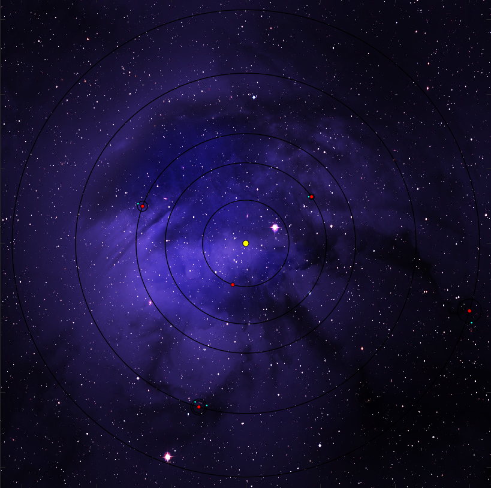

# Simulera solsystemet
## Om
Detta är ett projekt inom kursen *Ingenjörsvetenskap och Rymdteknik* som handlar om att visualisera hur planeter och dess månar rör sig i relation till varandra och solen i matlab.

*Backgrund från [pxfuel.com](https://www.pxfuel.com/en/free-photo-oodnd)*

## Användning
Huvudfunktionen `Solsystem` i filen *Solsystem.m* tar in 5 vektorer. Den första är planetbanornas radie, sen deras omloppstider i en av planeternas dagar (baserad på på jorddagar). Därefter kommer en vektor som innehåller indicies för vilken planet månarna kretsar runt. Sättet månarna beräknas och ritas ut på gör att det ignorerar indicies som är för stora. De två sista vektorerna är månbanornas radie respektive omloppstid. 
## Deltagare
Rasmus Jacklin - jacras-1@student.ltu.se \
Georg Berggren - geober-1@student.ltu.se